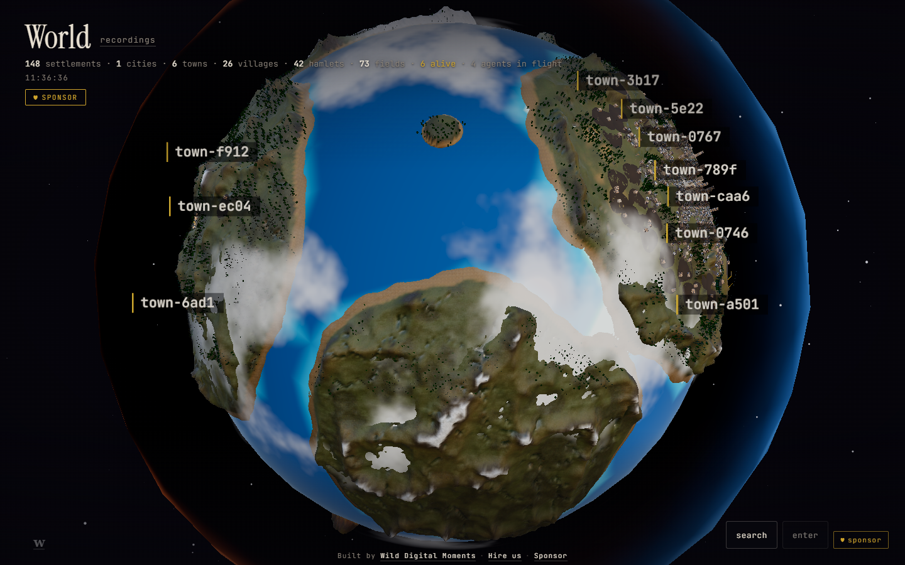
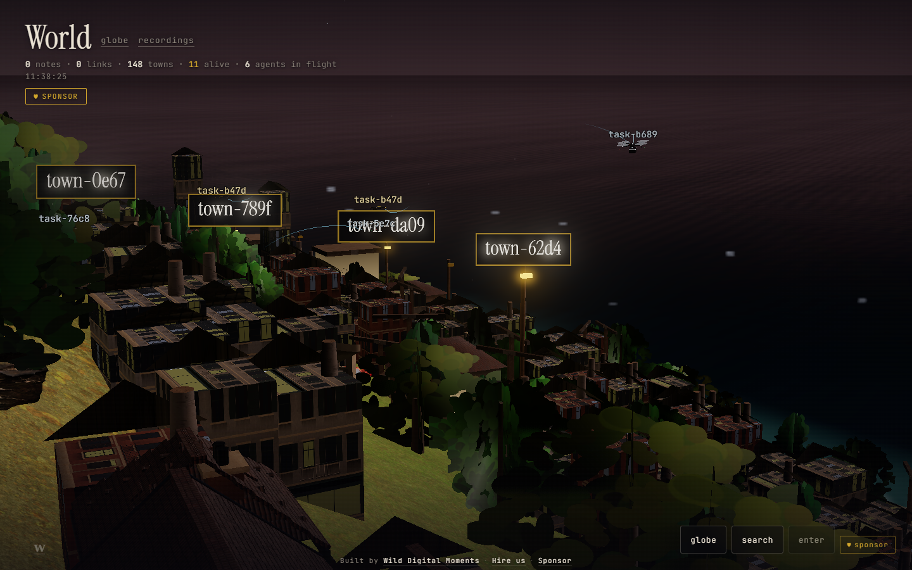
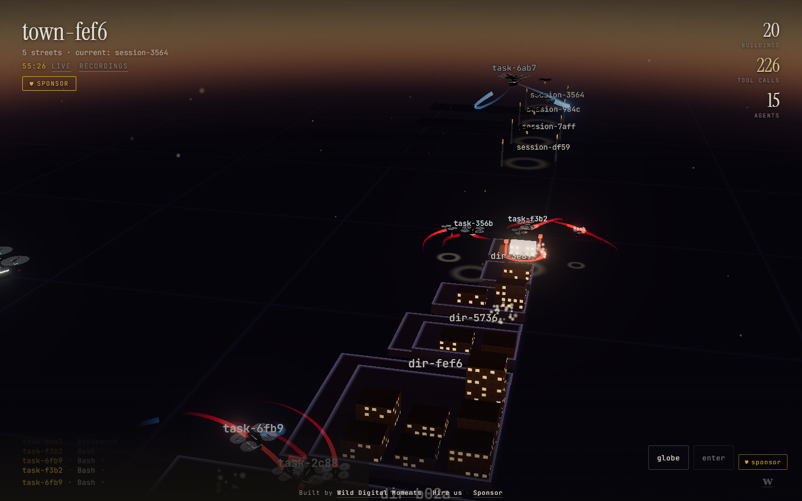
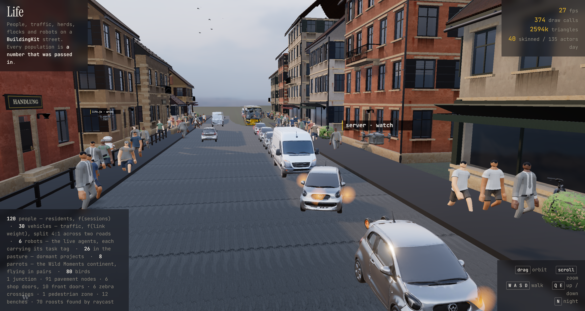
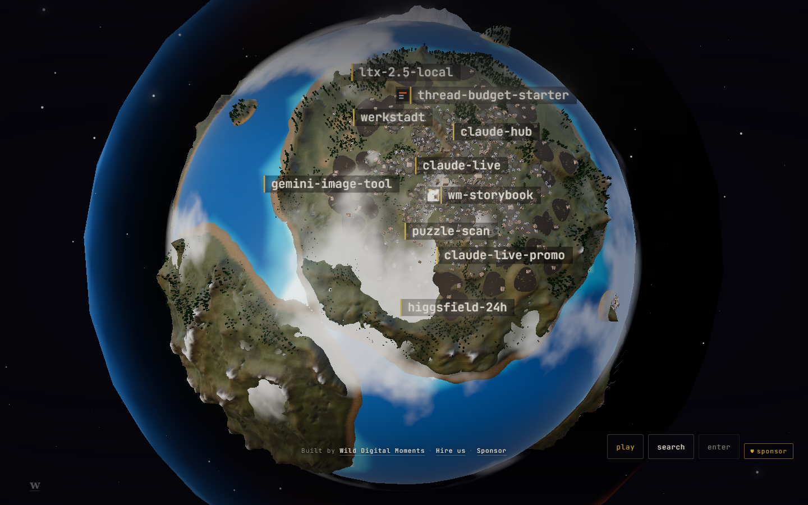

# Werkstadt

A live 3D world for your Claude Code sessions.


**[♥ Sponsor Werkstadt](https://digital.wildmoments.at/werkstadt/#sponsor)** — it is built and maintained by one studio, and sponsorship is what pays for the next phase.

## What it is

Werkstadt reads the transcripts Claude Code already writes to `~/.claude/projects/**/*.jsonl` and draws them as a place you can fly through.

- **`globe.html`** — every project you have ever worked in, as one planet. Projects land on continents according to rules you set in `config.json`.
- **`world.html`** — the same data as a single island with a harbour: one quarter per project, roads for links, ships and cranes.
- **`index.html`** — one session as a city. Every file you touch prints itself as a building, every agent flies a drone, and you can walk into a building and read the file on its walls.
- **`recordings.html`** — a shelf of MP4 films the server renders from finished sessions.

The server is `server.py`: Python standard library only, no packages to install. The pages are plain HTML, CSS and JavaScript with three.js loaded from a CDN. There is no build step — edit a file, reload the browser.

## Screenshots

All five are the real thing running on the author's machine, and the first three
are running with `"redact": true` — the shape of his work with none of the names,
which is what the Privacy section below is about. A town reads `town-3b17` rather
than a client, a street `session-3564` rather than a prompt, a building
`file-9e12.css`. Yours would say what they actually are.


*`globe.html` — every project you have ever worked in, as one planet. Continents come from rules you write in `config.json`; the masthead counts 148 settlements across 1 city, 6 towns, 26 villages, 42 hamlets and 73 fields, with 6 alive and 4 agents in flight.*


*`world.html` — the same data as one island. A quarter per project climbing the shore, roads for the links between them, and a drone overhead for every agent in flight carrying that agent's task tag.*


*`index.html` — one project as a city, live. Every street is a session, every building a file, and the red rigs are files being written right now. This is what redaction looks like from the pilot's seat: the city is unchanged, the labels are pseudonyms.*


*The living layer at street level. The panel is the point: 120 people are a function of the session count, 30 vehicles of the link weight, 6 robots are the live agents each carrying its task tag, 26 grazers are dormant projects. No population on screen is a number somebody typed in.*


*`globe.html?wallpaper=1` — wallpaper mode, which Lively paints behind your desktop icons. The masthead is gone, the controls and the credit line lift clear of the taskbar, and clicking still works. Not redacted, on purpose: those are the author's own open-source repositories. Yours would be your own directory tree, all day, which is why the Privacy section exists.*

There is more the pictures cannot hold still: you can walk into a building and
read the file's own source on its walls, 66 lines to a floor, with an `.html`
file getting a window that shows the page those bytes actually make. Under
redaction those walls carry a notice instead.

## Install in 30 seconds

```
git clone https://github.com/beriki770-ship-it/werkstadt && cd werkstadt
python assets/fetch_assets.py --release
python server.py
```

Python 3.9 or newer, no `pip install`, no build step. The server writes
`config.json` from `config.example.json`, prints its URL and opens `globe.html`
in your default browser.

The middle line is the asset library: 100 MB of textures, HDRIs and models that
are **not in git** and ship as a zip attached to the release, hash-checked on
the way in. Skip it and the world still opens — untextured ground, empty
streets — and the server tells you so at startup. `python
assets/fetch_assets.py` with no flag rebuilds the same library from its original
sources instead (Poly Haven, Kenney, Quaternius), which takes about eight
minutes and wants Node and Blender.

| flag | what it does |
|---|---|
| `--port 4952` | listen somewhere else than `config.json` says |
| `--vault <path>` | point the Obsidian layer at a vault for this run |
| `--redact` | pseudonymise every name for this run — see Privacy |
| `--no-browser` | start the server without opening a window |
| `--install-windows` | Windows only, opt-in: desktop shortcut, autostart at logon and the screensaver watcher, via `launcher/install.ps1`. Never happens on its own. |

On macOS and Linux there is no installer; `docs/RUNBOOK.md` carries the systemd
and launchd units to run it at login.

### As a Claude Code plugin

```
/plugin marketplace add beriki770-ship-it/werkstadt
/plugin install werkstadt@werkstadt
```

This adds a `werkstadt` skill that finds your checkout, starts the server if it
is not already listening, opens the page and can explain the privacy model. It
does not carry the world itself — the repository is still what you clone.

## Configuration

On first run `server.py` copies `config.example.json` to `config.json` and reads that. `config.json` is gitignored, so it is yours and an upgrade never overwrites it. Every path may use `~` for your home directory and either slash on Windows; an empty string means "not set", and the feature it belongs to switches off rather than guessing.

| key | default | what it does |
|---|---|---|
| `transcripts_root` | `~/.claude/projects` | Where Claude Code writes its session JSONL files. The only thing Werkstadt reads from outside its own folder, and it reads it read-only. |
| `vault` | `""` | **Optional, off by default.** An Obsidian vault drawn as the island's geography on `world.html`. Left empty, the vault layer switches off entirely — the globe and the island still run, they just have no land made of notes. |
| `host` | `127.0.0.1` | The interface the server binds. Loopback by default on purpose, because your transcripts are behind it. |
| `port` | `4949` | The port it listens on. |
| `auth_secrets` | `""` | **Optional.** A JSON file with `{"user": "...", "password": "..."}` that turns on HTTP Basic Auth for every non-loopback client. Only needed if you deliberately serve beyond `127.0.0.1`. Empty means the default `data/auth.json`, which is absent, which means auth is off. |
| `recordings_dir` | `recordings` | Where finished session films are written. A relative path is relative to the Werkstadt folder. |
| `trades_file` | `config/trades.json` | The keyword table deciding what a project's landmark building looks like — a plain, commented list of regex → schema.org type. |
| `project_names` | `{}` | Display-name overrides keyed by directory name, for when a folder name is not what you want written on the town: `{"acme-web-v2": "Acme"}`. |
| `excluded_dirs` | `[]` | Absolute paths that are not projects even though they look like one — a scratch folder, an inbox. Matched case-insensitively; subdirectories are unaffected. |
| `continents` | four rules | How a project's path picks its continent on `globe.html`. Rules are tried in order and the first whose `path_contains` appears in the lowercased path wins. Anything under your home directory matching no rule lands on `frontier`; anything outside it becomes an offshore island. Keys must be one of `wdm`, `wild`, `tools`, `knowledge`, `frontier`. |
| `aviary_projects` | `""` | **Optional.** A case-insensitive regular expression matched against a project's path and name; every match gets a small flock of parrots over its rooftops. Empty means no bird anywhere. |
| `redact` | `false` | Replace every project name, session title, file path, task tag and agent label with a stable pseudonym before it leaves the server. See Privacy below. `--redact` turns it on for one run. |

`--port` and `--vault` on the command line override the file for that run.

## Privacy

Werkstadt runs entirely on your machine: a Python standard-library server bound to `127.0.0.1`, and a browser page. Nothing is uploaded, there is no account, and there is no telemetry of any kind.

It reads your Claude Code transcripts in `~/.claude/projects/**/*.jsonl` read-only, and writes only into its own folder — it never modifies, moves or deletes a transcript.

Your transcripts can contain secrets, client names and absolute file paths, and Werkstadt draws file paths on screen as labels — so treat any screenshot, recording or wallpaper session the way you would treat your terminal scrollback.

Recordings are MP4 files written to `recordings/` on your own disk and are never uploaded anywhere; there is no share button and no hosted gallery, and deleting the file is the whole of the deletion process.

For the cases where the screen is not only yours — a recording, a talk, a screen share, the wallpaper — set `"redact": true` in `config.json`, or start the server with `python server.py --redact`.

Every project name, session title, file path, drone task tag and agent label is then replaced by a stable pseudonym (`town-3f9a`, `session-7c21`, `dir-04ab/file-9e12.css`) **before it leaves the server**, not hidden by the page — so a `curl` of any `/api/*` route is as clean as the screen is. Prompt and message text is dropped rather than pseudonymised, because there is no pseudonym for a sentence. File contents and page previews inside a building are replaced by a notice, and project favicons and Obsidian note titles are not served at all. The pseudonyms are a hash of the real name and nothing else, so the same folder is the same `dir-7c21` across restarts and across machines, and the world keeps its shape: same towns, same continents, same streets, same buildings. The city screenshot above is a redacted one.

Two things stop working while it is on, both by design: `aviary_projects` matches names that no longer exist, and a film recorded *before* you turned redaction on is left off the shelf, because its filename is a real session title. Films recorded while it is on are pseudonymous in their own filenames too.

## Other agents (roadmap)

Today Werkstadt reads Claude Code transcripts only. The renderer never sees Claude: the server
turns any session log into one event schema (`prompt`, `text`, `tool`, `agent_start`, `agent_end`)
and the world draws that. Adding another coding agent is one adapter in `server.py`, and a city is
per project, not per tool, so a project you touch with two agents gets one city with both crews.

Planned, in order: **Codex CLI** (JSONL session rollouts, closest to the current reader), then
**Gemini CLI**, then **Cursor**. Nothing is promised until it is verified on real logs. If you
want one of these first, open an issue with a sample of the log format.

## How it works

`server.py` reads the session transcripts, the file trees of the projects those sessions touched, and (if you point it at one) an Obsidian vault, and serves them as JSON and SSE over a handful of `/api/*` endpoints. The pages read that and draw it — `index.html` one session as a city, `world.html` everything as an island, `globe.html` everything as a planet. Nothing on screen is invented: every count, height and population is a division of something in the data.

The full read, endpoint by endpoint: [docs/HOW-IT-WORKS.md](docs/HOW-IT-WORKS.md).

## Hire Wild Digital Moments

Werkstadt was built by **Wild Digital Moments**, a web studio in Tirol, Austria. If you want something like this — a 3D product page, a live data world, an interactive model of a machine — that is the studio's day job.

- Studio: https://digital.wildmoments.at/
- Talk to us about a project: https://digital.wildmoments.at/werkstadt/

## Credits

**3D assets.** Everything under `assets/` is listed with its author, source and licence in [assets/CREDITS.md](assets/CREDITS.md). Two groups:

- **CC0 / public domain** — textures, HDRIs and scanned meshes from [Poly Haven](https://polyhaven.com/) (Rob Tuytel, Greg Zaal, James Ray Cock, Charlotte Baglioni, Amal Kumar, Dario Barresi, Jenelle van Heerden and others), model kits from [Kenney](https://kenney.nl/), and animated characters, animals and vehicles from [Quaternius](https://quaternius.com/). CC0 requires no attribution; they are credited anyway because provenance is worth keeping.
- **The author's own** — the `ornis` craft is Wild Digital Moments' own model from the ORNIS demo, released under this repository's licence. It is the only asset here that is not somebody else's CC0 work.

An earlier build used 35 models generated with Hunyuan Text-to-3D. They are not in this repository: the open-weights licence that would have covered their outputs excludes the EU in its own first sentence, and the hosted service's terms could not be retrieved, so nothing grants redistribution. `assets/fetch_assets.py --cc0` fills the same manifest keys from CC0 kits instead. Four subjects — a parrot, a chicken, a bus shelter, a playground — and the landmark buildings have no CC0 equivalent and fall back to drawn geometry.

**three.js** — the renderer, loaded from a CDN (`three@0.185.1` via jsDelivr). MIT licensed, © three.js authors.

**"Beri"** — the name appears throughout the code comments and the docs. It is the author, Shalom Dov Ber Kirsh, referring to himself; the comments were written for one reader and kept as they were rather than sanitised.

## Licence

Apache License 2.0 — see [LICENSE](LICENSE).

Copyright 2026 Wild Digital Moments — Shalom Dov Ber Kirsh
